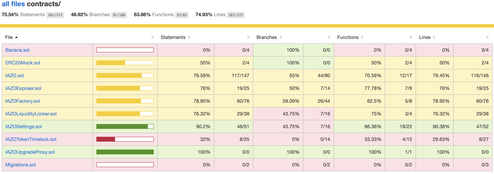
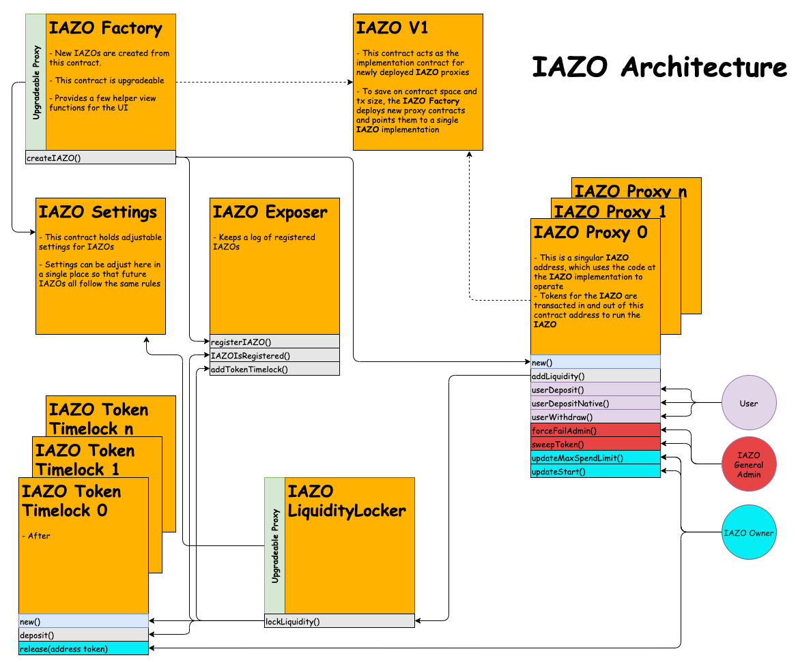

# IAZO - "Initial Ape Zone Offering"
  
IAZOs are self serve initial token offering contracts. New tokens that have yet to be released in circulation can be put up for sale with these contracts. If the sale is successful, then an APE-LP liquidity pair is automatically created on the ApeSwap DEX. A portion of the proceeds are put into liquidity and locked in a vesting contract while the creator of the IAZO is sent the rest. 

# Development
[](https://github.com/ApeSwapFinance/apeswap-iazo/actions/workflows/CI.yml)

* [IAZO Documentation](docs/)
## Tools

Truffle Framework:
- Compile contracts
  - solc/network config: [truffle-config.js](truffle-config.js)
- Deploy contracts to: 
  - BSC
  - BSC Testnet
  - Development `8545` (run dev chain with: `npx ganache-cli`)

Open Zeppelin
- Base contract imports
- Test environment 
- Test helpers 


## Env Vars
To deploy and verify contracts environment variables must be set in a `.env` file. See [.env.example](.env.example) for a list of relevant variables.


## Compile
`yarn compile`

## Deploy Contracts

`yarn migrate:bsc`   
`yarn migrate:bsc-testnet`   
`yarn migrate:dev`   

## Verify

`yarn verify:bsc`
`yarn verify:bsc-testnet`


## Test and Coverage
To run tests written in the [test](test/) dir, run:  
`yarn test`  

A coverage tool is provided with a nice UI interface:   
`yarn coverage`  

## Coverage Report



<br>

## Docs 
`solidity-docgen` is used to provide markdown docs generated from comments in the solidity contracts.  

To generate/update the docs run:  
`yarn gen:docs`  

Find the docs here: [IAZO Docs](docs/)


<br>
<br>

# IAZO Operation

## IAZO Flow

IAZOs work on a first come, first serve basis by selling tokens at a predefined price. They are only open for a set period of time (see IAZO settings below). If the soft cap (minimum number of tokens sold) of the IAZO is not reached before the IAZO is over, then it is considered a failed IAZO. Users will not receive IAZO tokens, but will get a refund. On the other hand, if the hard cap is reached (maximum number of tokens sold) then the IAZO will end early and users can withdraw their IAZO tokens at that time. 


## IAZO State

* The IAZO state can be found by calling `IAZO.getIAZOState()`. 

```
State 4: FAILED - Refunds enabled. Soft cap not met by end timestamp or admin force fail. 
State 3: HARDCAP - All tokens have been sold before end timestamp
State 2: SUCCESS - Soft cap and end timestamp have been reached
State 1: ACTIVE - Deposits enabled
State 0: QUEUED - Awaiting IAZO start timestamp
```

## IAZO Settings

IAZO settings are configured in the [IAZOSettings](./contracts/IAZOSettings.sol) contract. These settings are referenced when creating new IAZOs from the [IAZOFactory](./contracts/IAZOFactory.sol).

```js
  // Percentages are multiplied by 1000
  SETTINGS.ADMIN_ADDRESS                // Passed on deployment
  SETTINGS.BASE_FEE = 50;               // .05 (5%) - initial base fee %
  SETTINGS.MAX_BASE_FEE = 300;          // .30 (30%) - max base fee %
  SETTINGS.IAZO_TOKEN_FEE = 50;         // .05 (5%) - initial iazo fee %
  SETTINGS.MAX_IAZO_TOKEN_FEE = 300;    // .30 (30%) - max iazo fee %
  SETTINGS.NATIVE_CREATION_FEE = 1e18;  // 1 native token(s)
  SETTINGS.FEE_ADDRESS                  // Passed on deployment
  SETTINGS.MIN_IAZO_LENGTH = 43200;     // 12 hrs (in seconds)
  SETTINGS.MAX_IAZO_LENGTH = 1814000;   // 3 weeks (in seconds) 
  SETTINGS.MIN_LOCK_PERIOD = 2419000;   // 28 days (in seconds)
  SETTINGS.MIN_LIQUIDITY_PERCENT = 300; // .30 (30%) of raise matched with IAZO tokens
  SETTINGS.BURN_ADDRESS = 0x000000000000000000000000000000000000dEaD;
```

## IAZO Architecture





